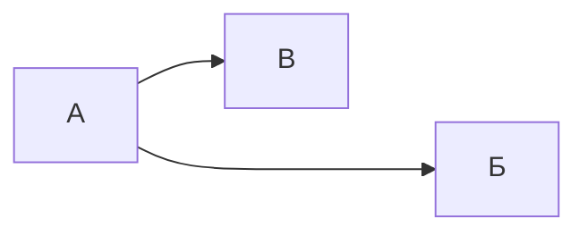

---
{"title":"Style test","date created":"2022.06.30, 11:57","date modified":"2022.10.14, 12:00","aliases":[],"tags":[],"dg-publish":true,"permalink":"/7-radio-engineering/style-test/","dgPassFrontmatter":true}
---


# Style test

# Заголовок 1

## Заголовок 2

### Заголовок 3

#### Заголовок 4

##### Заголовок 5

###### Заголовок 6

Размер самого текста тоже интересен

## Цитаты

> Переход в мир логарифмов сохранил астрономам тысячи лет жизни.
>
> Лапласс

## Код

Строчный `код`, доступный в любом месте.

```c
int main() {
	printf("Hello word");
}
```

## Таблицы

| Столбец 1 | Столбец 2 |
| --------- | --------- |
| Строка 1  | Строка 1  |
| Строка 2  | Строка 2  |

## Форматирование текста

- **Жирное выделение**
- *Курсивное выделение*
- ==Цветное выделение==
- ~~Зачёркнутый текст~~

## Mermaid



## Вставка страниц


<div class="transclusion internal-embed is-loaded"><a class="markdown-embed-link" href="/7-radio-engineering/m-matematicheskie-metody-prikladnoj-elektrodinamiki/" aria-label="Open link"><svg xmlns="http://www.w3.org/2000/svg" width="24" height="24" viewBox="0 0 24 24" fill="none" stroke="currentColor" stroke-width="2" stroke-linecap="round" stroke-linejoin="round" class="svg-icon lucide-link"><path d="M10 13a5 5 0 0 0 7.54.54l3-3a5 5 0 0 0-7.07-7.07l-1.72 1.71"></path><path d="M14 11a5 5 0 0 0-7.54-.54l-3 3a5 5 0 0 0 7.07 7.07l1.71-1.71"></path></svg></a><div class="markdown-embed">


# =m Математические методы прикладной электродинамики

- Мат. методы прикладной электродинамики подразделяются на 2 большие темы:
	- [[7-radio-engineering/Краевая задача\|Краевая задача]], её решение, которое применяется для расчёта [[7-radio-engineering/Волновод\|Волновод]]ов;
	- [[7-radio-engineering/Интегральное уравнение\|Интегральное уравнение]], его решение, которое применяется для расчёта антенн.

## Основные темы дисциплины

- [[7-radio-engineering/Метод разделения переменных\|Метод разделения переменных]] — основной применяемый метод для решения [[7-radio-engineering/Дифференциальное уравнение\|дифференциального уравнения]].
	- [[7-radio-engineering/Метод Фурье\|Метод Фурье]] — МРП применительно к [[7-radio-engineering/Дифференциальное уравнение в частных производных\|дифференциальным уравнениям в частных производных]].
- [[7-radio-engineering/Уравнения Максвелла\|Уравнения Максвелла]] — уравнения, описывающие все электромагнитные явления.
- [[7-radio-engineering/Волновое уравнение\|Волновое уравнение]] — лежит в основе всего. Где оно используется:
	- [[7-radio-engineering/Задача малых продольных колебаний однородного стержня\|Задача малых продольных колебаний однородного стержня]]
	- [[7-radio-engineering/Задача малых поперечных колебаний струны\|Задача малых поперечных колебаний струны]]
- [[7-radio-engineering/Дисперсия волн\|Дисперсия волн]]
	- [[7-radio-engineering/Дисперсионное уравнение\|Дисперсионное уравнение]] — уравнение зависимости частоты волны от [[7-radio-engineering/Волновой вектор\|волнового вектора]].
- [[7-radio-engineering/Проекционные методы\|Проекционные методы]] — средство нахождения приближенных представлений электромагнитного поля.
	- [[7-radio-engineering/Метод частичных областей\|Метод частичных областей]]
- [[7-radio-engineering/Вариационный метод\|Вариационный метод]]
- [[7-radio-engineering/Спектральный метод\|Спектральный метод]]
- [[7-radio-engineering/Пути постановки задачи в электродинамике\|Пути постановки задачи в электродинамике]]
- [[7-radio-engineering/Как в волноводе навязывается конкретная волна\|Как в волноводе навязывается конкретная волна]]

---

- [[7-radio-engineering/Базис\|Базис]]

## Задачи на стык

1. [[7-radio-engineering/Задача расчёта собственных значений и полей П-образного волновода\|Задача расчёта собственных значений и полей П-образного волновода]].
2. Задача расчёта стыков двух П-образных волноводов, которые отличаются размером гребня. 18:45.
3. Задача расчёта стыка П-образного волновода с МПЛ.
4. Задача расчёта экранированной МПЛ.
5. Задача расчёта стыка коаксиального кабеля и экранированной МПЛ.

### Теория (изучить)

- [[Скалярный потенциал\|Скалярный потенциал]]
- [[Дифференциальный оператор\|Дифференциальный оператор]]
	- [[7-radio-engineering/Оператор набла\|Оператор набла]]
	- [[Градиент\|Градиент]]
	- [[Ротор\|Ротор]]
	- [[Дивергенция\|Дивергенция]]
- Модуль Юнга
- Теорема Гука


</div></div>

